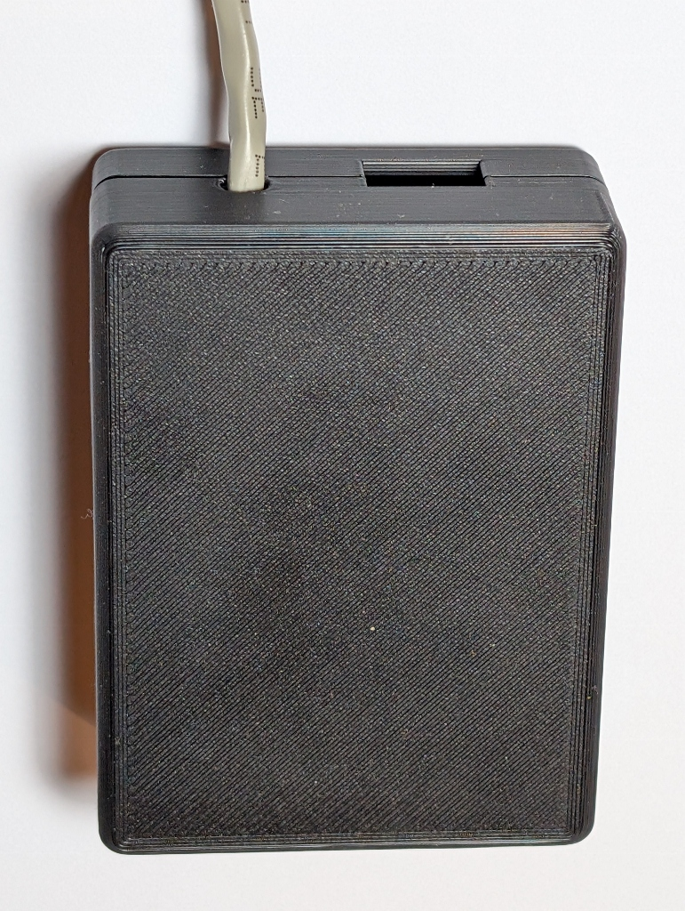
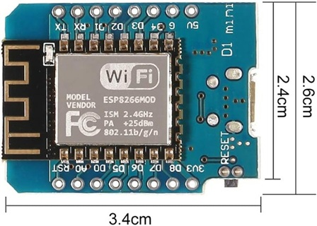
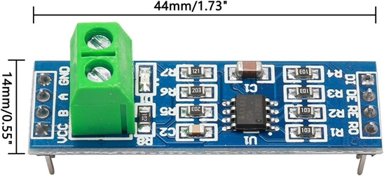
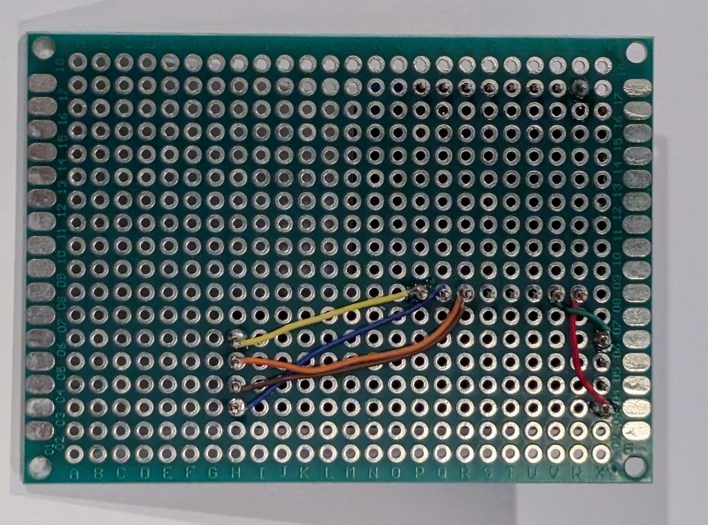

# Project Box for WaterFurnace Aurora (ESPHome)

I recently found the amazing project [WaterFurnace Aurora for ESPHome](https://github.com/daemonp/esphome_waterfurnace_aurora). Amazing because I'd seen [WaterFurnace Aurora Gem](https://github.com/ccutrer/waterfurnace_aurora/blob/main/README.md) and was planning on porting it to ESP32 so I could avoid having to setup a docker or Raspberry Pi to get it up and running in my system. Turns out, it had already been done even better than I was planning as it also removed the MQTT requirement (fewer moving parts) and also made it ESPHome compatible (good HW support, simple build/install/upgrade). 

The only thing [WaterFurnace Aurora for ESPHome](https://github.com/daemonp/esphome_waterfurnace_aurora) was missing was good assembly instructions and a nice project box to hold it all in. The goal of this repo is to supply the missing guidance: a simple, reliable project box and a straightforward build process.

## Parts List

| Component | Image |
|----------|--------|
| D1 Mini ESP8266 [Amazon Link](https://www.amazon.com/dp/B08C7FYM5T?th=1) |  |
| MAX485 Transceiver Module [Amazon Link](https://www.amazon.com/dp/B00NIOLNAG?ref=ppx_yo2ov_dt_b_fed_asin_title) |  |
| PCB Prototype Board Kit [Amazon Link](https://www.amazon.com/dp/B072Z7Y19F) |  |
| 30 AWG Wire Wrapping Wire [Amazon Link](https://www.amazon.com/dp/B0BJ86D1Q3?ref=ppx_yo2ov_dt_b_fed_asin_title) |  |
| 30 AWG Wire Wrapping Tool [Amazon Link](https://www.amazon.com/dp/B0B6GH5HHX?ref=ppx_yo2ov_dt_b_fed_asin_title&th=1) |  |

## Print the Project Box

A ready‑to‑print enclosure is included:

- **STL file:** [projectbox.stl](projectbox.stl)  
- **Source:** [projectbox.scad](projectbox.scad)

The model was created using **[OpenSCAD](https://openscad.org/)** and **[YAPP_Box](https://github.com/mrWheel/YAPP_Box)**, making it easy to customize dimensions or features if needed.

## Create the Cable

You can cut an existing Ethernet patch cable or crimp your own using CAT5/5e.

1. Ensure the RJ45 end is wired to **[TIA-568-B](https://upload.wikimedia.org/wikipedia/commons/6/60/RJ-45_TIA-568B_Left.png)**.  
2. Strip the opposite end and twist the following pairs together:
   - White/Orange + White/Green → **RS485 A / +**
   - Blue + Orange → **RS485 B / ‑**

This matches the WaterFurnace Aurora wiring scheme.

## Assembly Instructions

1. Insert the **D1 Mini** and **MAX485 module** into the prototype PCB.
1. Solder some of the pins to the PCB to hold the parts in place
1. Use 30 AWG wire to wire the ESP8266 to the RS‑485 module.  
1. (Optional) Add a small amount of solder to secure wrapped connections.  
1. Feed the RJ45 cable through the round opening
1. Insert the twisted pairs into the MAX485 screw terminals and tighten.
1. Place the assembled PCB into the printed project box.  
1. Secure the RJ45 cable with a zip‑tie for strain relief.  

### Wiring Reference

| Heat Pump (RJ45) | Wire Color (T568B) | RS485 Module | ESP8266 |
|------------------|--------------------|--------------|---------|
| Pin 1 (RS485+)   | White/Orange       | A / +        | — |
| Pin 2 (RS485–)   | Orange             | B / –        | — |
| Pin 3 (RS485+)   | White/Green        | A / +        | — |
| Pin 4 (RS485–)   | Blue               | B / –        | — |
| —                | —                  | DI (TX)      | TX |
| —                | —                  | RO (RX)      | RX |
| —                | —                  | DE/RE        | D1 |
| —                | —                  | VCC          | 3.3V / 5V |
| —                | —                  | GND          | GND |

Once assembled, snap the lid on, connect it to your WaterFurnace system, and your ESPHome Aurora interface is ready to use.
